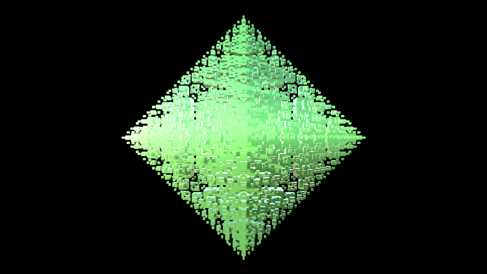
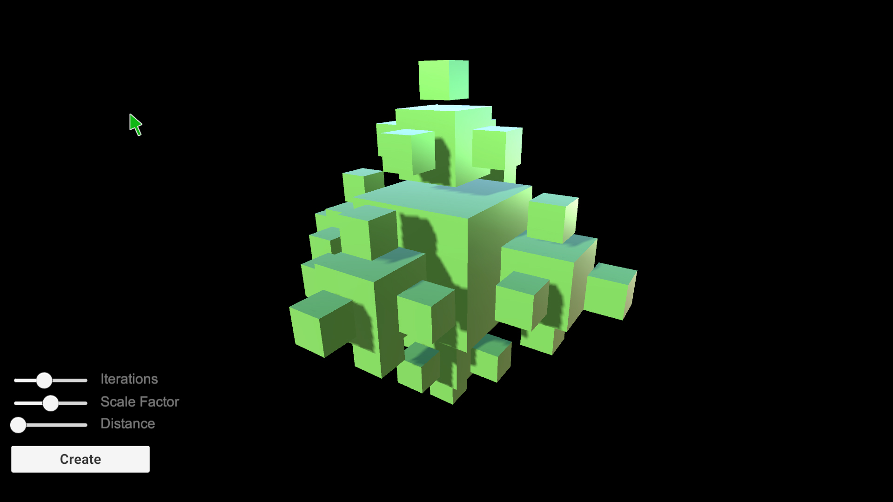
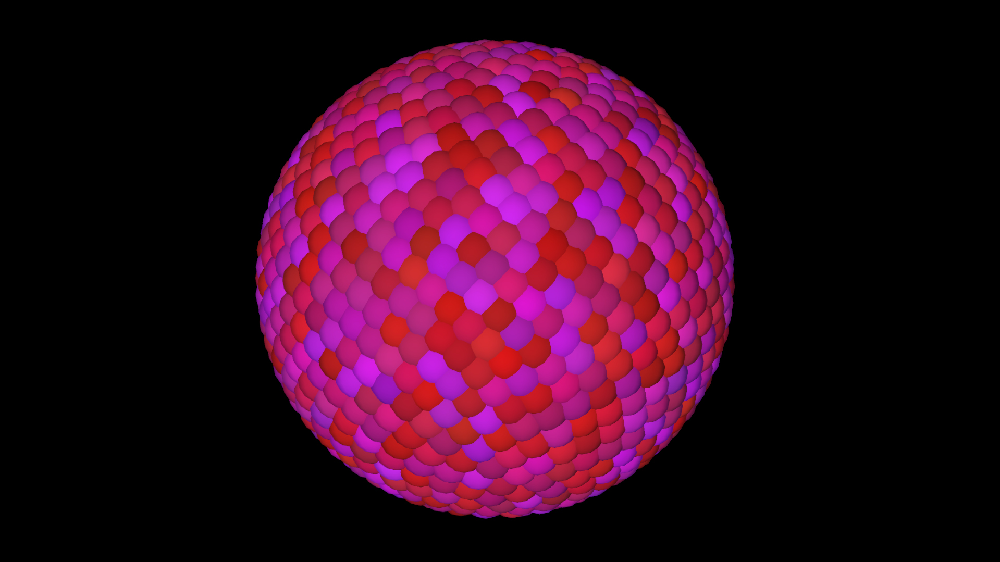

# Arte Generativa - Experimentos

Experimentos de Arte Generativa na Unity

### Imagens

### Funções

- Espaço: visibilidade HUD;
- Tecla "A" e tecla "B": altera cenas;
- Uso de Mouse;
- HUD interativa;
